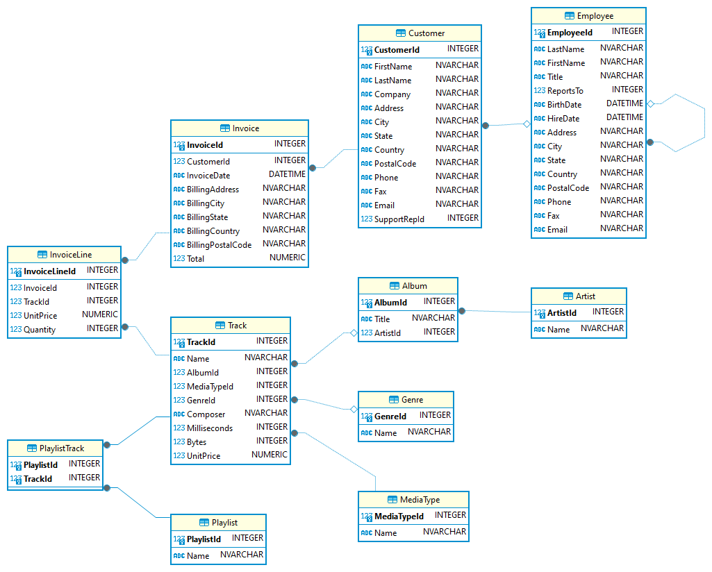

# Coding Challenge: Album Purchase Percentage
This coding challenge assumes you are using the SQLite3 implementation of the Chinook database

## Challenge

The Chinook Music Company has hired you to parse out data metrics from their sales data. At this time, the company is interested in determining what percentage of songs customers have purchased from each Album they have bought one or more songs from. Your job is to craft an SQL query to find this information for them.

Create a query that returns the first and last name of the customer in a column labeled "Customer", the name of the album that one or more tracks were purchased from according to the invoices in a column labeled "Album", and the percentage of songs from the album purchased according to the invoices in a column labeled "PercentagePurchased". The "PercentagePurchased" column should display the percentage of songs purchased from the album by the customer rounded to two decimal places.

You can assume the following table structures:

## Example
Given the tables and data in the Chinook database, the expected output of the query should look like:

| Customer | Album | PercentagePurchased | 
|----------|-------|---------------------| 
| Alice Adams | Album A | 50.00 | 
| Alice Adams | Album B | 75.00 | 
| Charlie Davis | Album C | 33.33 |

## Constraints
- The output should include customers who have purchased tracks from at least one album.
- Round the percentage to two decimal places.
- Sort the results by the customer's full name in ascending order.
