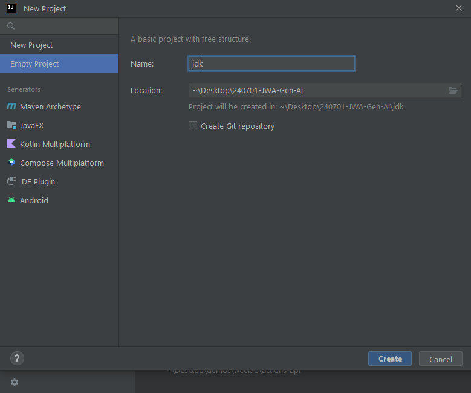
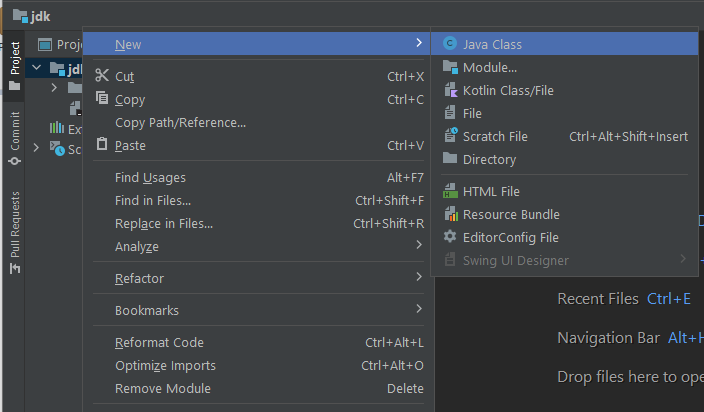
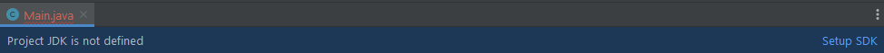
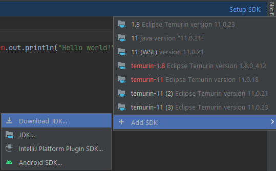
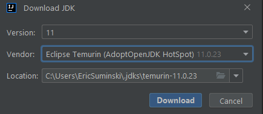

# JDK Setup Instructions
1. Create a new empty project 
2. Right click the root folder, then choose "Java class" in the new section at the top of the menu 
3. Give the class a name and let Intellij create and open the file. This should prompt Intellij to inform you either that a default JDK has been selected (if you have one downloaded already) or it will prompt you to select an SDK 
    - if Intellij already has access to a bundled JDK you may get a notification in the bottom right of your screen indicating that JDK is in use. You can leave it as the default option or choose the option to download a new option
4. Click the Setup SDK link and choose a JDK to download and use 
    - if you have already downloaded a JDK you want to use but still need to select it, choose the JDK from the list of option in the initial menu
5. For maximum compatibility choose version 11 from vendor Eclipse Temurin (AdoptOpenJDK HotSpot) 
6. Wait for the download to complete, and then you should be good to go!