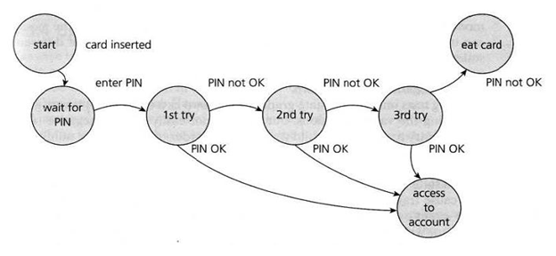

# Testing
According to the ANSI/IEEE 1059 standard, Software testing is a process of analyzing a software item to detect the differences between existing and required conditions (i.e. defects/errors/bugs) and to evaluate the features of the software item. In other words, testing is the process of checking a system and/or its components against specification to determine whether or not the system meets those requirements.

Software testing can be done either manually (by a human using the system) or it can be automated by writing tests with code. Usually when we discuss software testing we are referring to the latter. There are many existing software libraries and frameworks in many languages that can assist with testing. Writing tests is a crucial way to ensure the quality and effectiveness of a piece of software.

Testing should not be...
* Optional
* An afterthought
* A chore
* Time-consuming
* Strictly about code coverage

When creating and executing tests, you want to make sure that you:
* Clarify and unambiguously state the requirements of the system
* Ensure software meets the stakeholders' expectations, and helps achieve business objectives
* Can easily identify areas that do not meet requirements
* Quickly and easily make changes to your application and tests if needed
* Assure product quality

### Software Quality
A term heard often when discussing testing is Quality Assurance. Though there are similarities to testing and quality assurance, there are some key differences to keep in mind. For starters, let's examine what quality means. Quality can describe an application's conformance with:
* Functional aspects and Structure aspects
* Both focused on finally meeting stakeholders' expectations

Quality Assurance therefore refers to the maintenance of a desired level of quality in a service or product, especially by means of attention to every stage of the process of delivery or production. 
Quality assurance also:
* Ensures that the correct process is followed to develop software and focuses on avoiding defects from getting introduced in software. 
* Should be maintained throughout each step of the development process, unlike testing which is often reserved for finding issues after the creation of a product. 
* Emphasizes the usage of standard software development processes and practices to guarantee quality.
* Increases chances of developing a final product that is bug-free and meets stakeholders' requirements

In order to ensure quality is maintained, Quality Control is utilized. 
Quality Control is...
* A system of maintaining standards in manufactured products by testing a sample of the output against the specification.
* Checks if the product/software that has been developed works as per requirements specifications.
* Focuses on finding defects in the product/software.

An integral part of this quality control process is the [Software Testing Life Cycle](#testing-life-cycle). Thus, we write tests as part of a quality control mechanism to keep software quality high.

## Testing Pyramid
When determining costs for tests, it is useful to keep the "Testing Pyramid" in mind. This "Test Pyramid" is a visual representation of the cost vs abundance of tests based on certain "levels" of testing. More tests exist at the lower level of the pyramid than at the top because they exist at a lower level of abstraction (unit tests), whereas fewer exist at the top and focus on a higher layer of abstraction (system tests, UI tests, UAT).

* Unit Testing
  * Most micro-level of testing
  * Test each component without dependencies
  * Usually requires data mocking
  * Unit testing tools include Junit and TestNg
* Integration Testing
  * Test components with dependencies
  * Check that components work with one another correctly
  * Logically related modules are tested as a group
  * Integration testing tools include selenium and protractor
* System Testing
  * Test the entire application as a whole
  * Ensure the entire application works without errors
* User Acceptance Testing (UAT)
  * Test all requirements/user stories are met
  * Simulate an end-user to guarantee that users can actually perform all the tasks the request and are supposed to
  * Generally UAT is handled by a physical user
  * Two General forms of UAT, Alpha and Beta
    * Alpha Testing
      * First round of UAT (normally this is in-house builds and teams)
    * Beta Testing
      * Testing done "out-of-house"

## Testing Principles
- Testing Reveals Defects, Not their absence
    - 0 defects discovered does not mean there are no defects in the tested software
- Exhaustive Testing is not possible
    - testing should be focused on critical features/requirements first
- Test early
    - the sooner testing is started the more robust and meaningful the testing will be
- Defects Cluster
    - any feature/requirement with one or more defects warrants extra testing
    - defects tend to cascade, especially if the defect is at the start of any data transformation or if other features require the data involved in the defect
- Pesticide Paradox
    - your tests will eventually exhaust all defects they can find: when this happens it is worth considering additional tests to accommodate the addition of new features or requirements
- Test Context Matters
    - similar to exhaustive testing not being possible, the context of what you are testing should determine how you perform your testing
- Absence of Error Fallacy
    - just because there are no defects does not mean your application is good

# Terminology

## Test Case
- A test case is a formal collection of data and steps necessary to validate if a requirement is fulfilled
- All the following documents are meant to assist in the fundamental task of creating and executing test cases

## Test Basis/Test Analysis
- one or more documents that provide a high level view of what needs to be tested. Some examples:
    - Software Requirement Specifications (SRS): this document lists the functional and non-functional requirements of the software
    - Business Requirement Specifications (BRS): this document lists the high-level business goals of the application
    - Architecture and Design documents: any documents that list design information about the application or application flow that can assist the testers in providing context about the application
- these documents and more should be referenced when deciding on what to test and how to perform the testing

## Test Objective
- specified goals of testing
- these will change depending on what you are testing and what tools you have access to

## Test Suite
- a collection of tests cases
- these are typically grouped by feature or requirement being tested
- useful especially when doing automated testing to help recognize what feature/requirements have defects

## Test Data
- resources used to execute test cases
    - login tests require login credentials
    - registration tests require new usernames and passwords
    - file upload tests require files to upload
    - data transformation tests require whatever data needs to be transformed
    - etc.

## Test Object
- the feature/requirement/module/software being tested
- this is a catch all term that is flexible: it is simply a reference to whatever it is you are testing

## Positive Testing
- validating that a feature works when data that meets all requirements is provided

## Negative Testing
- validating that a feature behaves as intended when data that does not meet all requirements is provided

## Defect
- deviation from intended behavior or outcome
    - A user providing incorrect login credentials is given a login failed message, but still redirected to the home page of the application
- revealed through testing
- sometimes the result of error in the code base
- sometimes the result of incorrect configurations or settings
- sometimes the result of user error (must be careful of this when manually testing)

## Error
- a flaw or mistake in code logic
    - infinite loop
    - un-handled exception
    - etc.
-  errors that are not caught by developers will usually lead to one or more defects

## Failure
- a defect/error that is not caught in testing and later discovered in production/deployment
    - users report they can't view their profile page
    - the application can't be reached by end users due to production environment issues
    - etc.
- these can be related to missed defects, but they can also be issues with the environment the application is in

## Verification vs Validation
- Verification: did we build the product right?
  - Verify by passing test cases
- Validation: did we build the right product?
  - Validate by passing user acceptance testing or confirming with the client

# Technique

## Use Case
- A high level description of an application requirement, typically from a business perspective
- includes the necessary details to craft scenarios and test data in order to create Test Cases

## User Story
- User stories are high-level, business artifacts that define software requirements or application features.
    - They should define these from the perspective of an end-user.
- User stories are designed from the System/Software Requirements.
- Can be thought of as individual scenarios of a Use Case

## Black Box vs White Box
- Black Box testing is testing software without access to the source code
    - think manually walking through an application to check if things work
- White Box testing is testing software with access to the source code
    - think writing code to automatically check your methods work correctly

## State Transition Diagram
- a flowchart showing the possible conditions of the test object
- useful when you need to track the state of the test object and validate the feature works as intended when the state is modified

## Decision Tables
-  a table that includes possible inputs and expected outputs from the associated combination of inputs
    - think a table with username and password combinations, with a third table indicating if the pairing should log the user in or not

## Boundary Value Analysis
- a table with columns representing "classes" of data that are either valid or invalid based on the "boundaries" of your software requirements
    - if a username can be between 5-15 characters long then you would have 4 classes:
        - 4 character username
        - 5 character username
        - 15 character username
        - 16 character username

## Equivalence Partitioning
- a table with columns representing "classes" of data that are either valid or invalid. One input that meets the criteria of the class is used to represent all possible combinations of data for that class
- Usually there will be a common sense representative for data in a class, but especially for larger collections of characteristics, or when there is a significant number of possible inputs for a class, there will be a level of subjectivity in determining what data to use
- if your requirements include clear and cut boundaries then Boundary Value Analysis should be preferred as an organizational technique

## Error Guessing
- a black box testing technique where the tester uses intuition and knowledge of similar applications to make educated guesses about ways the application being tested could fail and designing tests around those educated guesses
- this technique is useful when there are minimal or ambiguous requirements, or when trying to conceive of new tests

## Exploratory Testing
- a white box testing technique where the tester explores the software being tested in order to learn how it works and to develop new meaningful tests for the software
- this technique is useful when the tester has access to the code for the software being tested

## Checklist Testing
- similar to checking items off a grocery or chore list, checklist testing involves following a pre-determined checklist of actions to verify and/or validate software 

## Statement Testing
- statement testing is a practice of validating that all "statements" of code are executed
- these tests help to confirm that code is being executed as expected, and in combination with other testing techniques can help narrow the location where errors and/or defects are being triggered

## Conditional Testing
- similar to decision tables, conditional testing involves grouping different combinations of "conditions" to determine what should happen next
    - if logged in then I should be sent to the homepage
    - if not logged in then I should be sent back to the login page

## Dynamic Testing
- verifying software meets requirements during execution of the application
    - most testing can be classified as Dynamic Testing

## Static Testing
- verifying software meets quality standard practices before code execution
    - comments are present where needed
    - privileged information is not hard coded into application
    - best practices are implemented
    - etc.
- This process is often facilitated by linting software, but also by manual review of the code base before Dynamic Testing is done

# Test Documents

## Test Plan
- A detailed document that describes how a team will handle testing for a product/system
    - includes details for the test strategy, objectives, schedule, estimates, etc.
- it might also be the central location that would specify what other documents are needed (test case document, requirements traceability matrix, etc.)

## Test Strategy
- a component of the test plan
- details (more specific than the Test Plan) the testing activities to be done and how to achieve them for a specific application, module, or feature
- can also include things like cost and effort estimations

## Test Schedule
- a document that outlines when testing needs to be finished for the different parts of the software you are testing
- in Agile development this is a living document: as adjustments are made the schedule will also change

## Requirements Traceability Matrix
- a document that maps the relationship between System Requirements/User Stories to the Test Cases that cover those requirements, and any defects that are revealed after testing

## Software Requirements Specification
- a document that lists the software that is needed for the application being tested to work
- this can also include restrictions on what the software should/should not allow from a business perspective
    - limiting characters for an input
    - sanitizing data
    - facilitating viewable data
    - etc

## Test Progress Report
- a document that tracks tests designed and executed
- works in conjunction with the test schedule

## Test Summary Report
- a collection of test case execution summaries
- usually grouped by test runs or cycles, which helps track progress on fixing defects

# Defect Management

## Feature vs Defect
We all know what a feature is: it is some kind of functionality in our application. A defect (or bug) can sometimes be a little trickier to determine. This is because there are just SO MANY WAYS an application can surprise you. You may write your tests, have them all pass, but then users report that their experience is nothing like what you expected it to be. Then there is the "it's not a bug: it's a feature" moments when something unexpected ends up staying in the code because you like what it does to or for the app. Because of this, there is a general defect lifecylce you should follow to determine whether an unexpected instance is truly a defect or a surprise feature

## Defect Lifecycle
1. A bug is reported (could be from a test, user reported, etc)
2. the bug is assigned to a person or team
3. The bug is analyzed and/or recreated
    - the bug will either be rejected or deemed worth addressing
    - it could be rejected because the bug could not be reproduced, it is deemed a feature instead of a bug, an upcoming updated will fix the problem, etc
    - in this case, the bug status will be closed/finished, and you move on
4. assuming the bug needs to be addressed/fixed, you work on the code and test it thoroughly
    - if you/ your team can not fix the bug you report it and the bug is reassigned
5. Once the bug is fixed you close the bug status and move on

## Defect Reports
Defect reports are simply how you report a bug. These can be incredibly basic (a text file that list the bugs needing to be fixed) or they can be incredibly complex (including defect id, project and product, release version, summary, descriptions, steps to replicate, expected vs actual results, comments, the list goes on). The means of reporting a defect and the expectations for how it should be done should be available either within the test strategy or test plan documentation. While working on your projects in training you should have a consistent way of reporting problems with your application to your teammates so that everyone is on the same page. It does not need to be fancy or all inclusive, but it should be consistent.

## Severity vs Priority
Severity and Priority are two different metrics for determining how much a defect affects your product. Severity is a measurement of how much the defect affects one or more features, while priority measures how quickly the defect ought to be addressed. Usually the two go hand-in-hand (high priority == high severity) but this is not always the case.
- high priority low severity
    - your company landing page has a competitors' logo in place of your own
    - functionally, this does not affect your website. That being said, promoting your economic competitor on your home page is not a great business move, so it should be fixed ASAP
- low priority high severity
    - your apps function to change names in the company database has completely broken
    - this would be annoying for those who are trying to fix or change their names in the database, but it does not break the ability for the app to do its intended job, so fixing something like the wrong logo on the landing page would be higher priority to fix first

## logging defects
If defect reports are a way of managing bugs as they arise, logging defects is a way of recording them for posterity. Again, the means of handling defect logging should be available to you in the test strategy/plan documentation, but for your own projects you will want to create a system of codifying and logging the bugs your application runs into. This can be useful for tracking any persistent bugs: knowing that your login system constantly bugs out may indicate you need to rework it from the ground up. Having the log is a good means of determining if such a drastic measure is warranted.