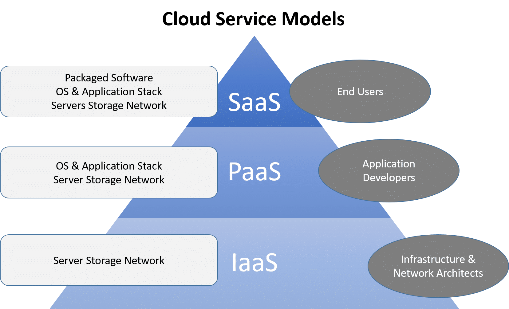

## AWS Orientation

### Introduction
Amazon Web Services (AWS) is one of several major cloud services providers, perhaps the biggest in terms of market share. AWS is a cloud computing platform that provides a wide range of infrastructure services such as computing power, storage, and databases, as well as application services, deployment, and management tools, all of which can be easily scaled up or down to meet changing demands. It is a flexible, cost-effective, and reliable solution that enables individuals and businesses to run applications and services in the cloud, with pay-as-you-go pricing and no upfront costs. There are six key advantages provided by the cloud:
1. Trade capital expense for variable expense.
    - instead of needing to guess at your traffic and processing needs you can use a flexible service that scales with your needs, both for the increase and decrease in traffic and processing power need.
2. Benefit from massive economies of scale.
    - because user actions are all aggregated in the cloud (read: it is all localized in the cloud and handled by the web service) you can benefit from a pay-as-you-go model that many web services providers like AWS use.
3. Stop guessing about capacity.
    - similar to the first bullet point, there is no need to guess at how much hardware and processing power you need: because of the flexibility of autoscaling you can avoid sitting on idle hardware or being unable to handle all the requests to your product
4. Increase speed and agility.
    - when you host your service locally you have to manually upgrade everything, which can take anywhere from hours to days. With cloud computing you have access to advanced hardware immediately.
5. Eliminate overhead cost of maintaining data centers
    - providers like AWS handle the maintenance of data centers, which means you don't need to budget for the servers, properties, maintenance crew, security, etc.
6. Go global in minutes.
    - because most services like AWS have global coverage you can choose what regions you want to deploy your app in and reduce latency and increase accessibility of your product with a few mouse clicks

There are three models of Cloud Computing:
- Infrastructure as a Service (IaaS):
    - a self-service model for managing remote data center infrastructures. AWS offers IaaS in the form of data centers. Essentially, this means that AWS itself is the IaaS
- Platform as a Service (PaaS):
    - allows organizations to build, run and manage applications without the IT infrastructure. AWS RDS is a PaaS: it provides a means of managing your product (storing the data related to it) without providing any infrastructure to manage it (need dbeaver or another program to interface with the database)
- Software as a Service (SaaS):
    -  replaces the traditional on-device software with software that is licensed on a subscription basis. It is centrally hosted in the cloud. A good example is Salesforce

#### Free Tier
There are a number of services which are "Free Tier eligible", meaning that the service can be free provided you adhere to the constraints. Free Tier is generally for you to learn about and test services. EC2, RDS, and S3 are all Free Tier for limited use. Free Tier is somewhat convoluted, and many services are tightly intertwined. Always be extremely careful when allocating AWS resources: If you are attempting to make use of Free Tier services check out the Free Tier offerings [here](https://aws.amazon.com/free/)

### Regions & Availability Zones
A **Region** is a geographic area served by AWS data centers. Regions are isolated from one another, and resources do not automatically replicate across regions. AWS spans 27 regions at the time of this writing, with data centers across the globe. An AWS Region is a geographical location with a collection of **Availability Zones** (AZ) mapped to physical data centers in that region. Every region is physically isolated from and independent of every other region in terms of location, power, water supply, etc. This level of isolation is critical for workloads with compliance and data sovereignty requirements where guarantees must be made that user data does not leave a particular geographic region. The presence of AWS regions worldwide is also important for workloads that are latency-sensitive and need to be located near users in a particular geographic area.

An **Availability Zone** (AZ) is a "highly available" logical data center within a region. Each AZ in a region has its own redundant power, networking, and connectivity to reduce the likelihood of multiple zones failing at once. While regions are separate, AZs are connected together to provide rapid fault tolerance and replication. If an AZ should fail, its workload will be redistributed to other AZs in the region

AWS has a few newer options for managing deployments as well:
- **Local Zones** are extensions of geographic regions, offering proximity to your users and ultra-low latency
- **Wavelength Zones** are designed to provide ultra-low latency to mobile users by placing the zone right at the edge of a telecommunication carriers' 5G network
- **AWS Outposts** allow you to extend AWS infrastructure into your own premises. By providing local access to AWS managed infrastructure, AWS Outposts enables customers to build and run applications on premises using the same programming interfaces as in AWS Regions, while using local compute and storage resources for lower latency and local data processing needs

### Common Services
We will be looking at several of the most foundational services offered by AWS. These are the services you are most likely to use while learning and practicing development concepts. EC2, RDS, and S3 will all be covered in greater detail in their own modules

**EC2**: The **Elastic Cloud Compute** service offers virtual machines, computers that function like any other by emulating physical components. Somewhere in AWS data centers there are powerful physical machines on which many EC2 virtual machines could potentially be running. EC2 machines can come in many sizes which represent overall computing power. Processors, storage, networking, operating system, and more can be customized to fit your needs. Pricing is based on use, so you aren't paying for idle resources

**RDS**: The **Relational Database Service** offers database hosting. An RDS instance is just an EC2 server specially set up to run a Relational Database Management Engine (RDBMS). This engine serves up your database for querying

**S3**: The **Simple Storage Service** offers object storage in the cloud. Instances of S3 are called "Buckets" and they can be configured for a variety of uses including site hosting and block storage. Note that an "object" is just about anything digital: if it is a type of file you can probably store it in an S3 bucket

**CodeBuild & CodePipeline**: CodeBuild and CodePipeline are CICD services. CodeBuild offers build servers which will build (compile, link, lint, etc.) your project. CodeBuild is often used as part of a larger CodePipeline, which manages the process of building, delivering, and deploying projects

**Elastic Beanstalk & Elastic Container Service**: Elastic Beanstalk offers web environments, scalable clusters of machines on which to deploy your web applications. An EB environment might include EC2 instances for servers, S3 buckets for storage, **CloudFormation** for scaling and orchestration, and **CloudWatch** for health monitoring. Similar to that is Elastic Container Service: a fully managed container orchestration service. This service is particularly useful if you need multiple containers to be networked together due to ECS managing the underlying infrastructure for you

The services listed are a fraction of the offerings AWS provides

## AWS RDS
RDS is a collection of services for operating a relational database server in the cloud. Take note of the three distinct things that we often call "databases":

- Database Server: A server like any other which hosts the engine
- Database Engine: The software that allows manipulation of the database
- Database: one or more files that store data in a systematic way

Amazon RDS helps us manage the Database Server and related infrastructure. We can choose our Database Engine (or management system) from one of the many implementations of SQL including: MySQL, PostgreSQL, MariaDB, and Microsoft SQL Server. Amazon even has its own implementation called Aurora.

An RDS instance is little more than an EC2 instance that has the RDBMS, or the Database Engine, installed and configured out-of-the-box. Your RDS instance can scale vertically, and can be set up to scale horizontally as well, though these features aren't covered by free tier. May features of the service can be handled by AWS (updates to the RDBMS, automated backups, data encryption) but not all of these offerings are strictly free tier. For instance, by default, AWS assumes you want your instance to auto scale storage up to 1000G, which is a value not covered by free tier. You as the developer have to turn off the feature

## AWS S3

### S3 Introduction
S3 is an object storage service that offers secure and scalable object storage in the cloud. S3 storage is broken into buckets, containers where your data can be found. These buckets can be configured independently and have no limits on how much data can be stored.

### S3 Bucket Configuration

#### Object Storage
Object storage refers to the way the data is organized, into objects rather than blocks or files. In practice, object storage is very similar to file storage, and both would be implemented physically as block storage. This layer of abstraction is why there is no limit on the data in a bucket, there is no finite volume to fill up. If you were to explore a bucket with data, you would find it to be very similar to any file system you are familiar with.

#### Storage Classes
There are a number of different storage classes, which control the way our data is stored and retrieved under-the-hood. Sometimes we need storage that is always fast, other times we might want to store data that is rarely retrieved and doesn't need to be instantly available:
- Standard - General purpose
- Intelligent-Tiering - automatically re-categorizes objects into appropriate tier based on usage
- Standard Infrequent Access - For data that is not accessed frequently
- One Zone Infrequent Access - Cheaper but only exists in one AZ
- Glacier Instant Retrieval - Archive storage for rarely accessed data
- Glacier Flexible Retrieval - Archive storage, asynchronous retrieval
- Glacier Deep Archive - Cheapest solution, for long term storage

### Hosting Static Sites
A web site is retrieved with an HTTP GET request to a URL, and the web server responds with the HTML, CSS, and JavaScript content that makes up the site. S3 buckets are already designed to serve data objects via HTTP and configuring them to host a site is as simple as one click. This will give you a public URL and have the S3 bucket respond to GET requests to that URL with your site as though it were a web server (which it basically is)

## AWS EC2

### EC2 Introduction
Amazon's Elastic Compute Cloud (EC2) is a web service that provides secure, resizable compute capacity in the cloud. It is designed to make web-scale cloud computing easier for developers. EC2s offer the following:
- Virtual Computing Environments (images)
    - preconfigured templates for your images known as Amazon Machine Images (AMIs). These include the OS and additional software you need
- Various instance types. These have differing CPUs, memory, storage, and networking capacity
    - an instance is a virtual server in the cloud
- secure login information for your instance
    - Amazon holds a public key, you keep a private key
    - security groups that determine who can access your instance via protocols, ports, and IP ranges
- Complete Control
    - As the creator of the instance you have root access to each of your instances, and you can start and stop them without losing access to the data they hold.
- Flexible Cloud Hosting Services
    - You can mix and match operating systems, cpu, memory, etc with your instances, creating exactly what you need to manage and run your web product.
- Elasticity
    - The "Elasticity" of EC2s is their ability to auto scale both up and down: when your system has higher demand the instance can add more processing power to handle the load, and when the traffic dies down it can revert to a lower processing power, saving you money in the long run.
    
### Security Groups
A Security Group controls incoming and outgoing traffic to and from one or more resources (like an EC2 instance). A VPC, or Virtual Private Cloud, is a logical grouping of AWS resources into a virtual network. A Security Group can only be applied to resources which exist inside its VPC.

Security Groups control traffic with rules. Rules make determinations about what traffic is allowed based on the following parameters:
- Protocol
- Port
- ICMP Type (Internet Control Message Protocol)
- Source or Destination

### SSH into EC2
EC2 instances can be opened up to be public facing and will be assigned a public address on the internet which can be used to access it remotely. SSH, or Secure Shell, is a network protocol that gives users a secure way to access a computer over an unsecured network. SSH is built atop the TCP protocol, and port 22 is commonly reserved for SSH traffic.

Access via the web console:
- On your AWS Management Console, navigate to EC2 > Instances
- Click on the instance you wish to access
- Click Connect at the top of the Instance Summary
- Click the orange Connect button
- This should open the web console and initiate an SSH connection to the server.

Access via local terminal: **NOTE** You will need a public/private key pair to access the server. This key should have been generated during the EC2 initialization process. If not, you can generate one and assign it to your instance
- On your AWS Management Console, navigate to EC2 > Instances
- Click on the instance you wish to access
- Click Connect at the top of the Instance Summary
- Select the SSH Client tab
- Instructions are given here, with an example console command. You will need to make sure you adjust the command to accurately reference the key file. You may need to adjust the file security settings on the key file, depending on the OS you are working with locally

### AMI
An image in this context refers to a binary snapshot of the state of a machine at a given moment. This image can be used to re-create that exact state. Generally, this is used to load software onto a system without having to install each item individually. When it comes to virtual machines, installing an OS and a bunch of software would be far too time consuming. So, instead, VMs launch with an image of a working machine and are ready almost immediately. Amazon Machine Images (AMIs) are images maintained and supported by AWS to be used to launch EC2 instances. They come in the form of ready-to-go operating systems with pre-installed software and pre-configured settings. There are AMIs for nearly any OS you can imagine, including many versions of Windows, MacOS, and Linux distributions. Amazon Linux 2 is a very common AMI, based on Amazon's own Linux distribution. It is optimized to work in the EC2 environment, and comes loaded with a minimal set of software packages to integrate with AWS services and act as a high-performance execution environment

### EBS (Elastic Block Storage)
Amazon EBS offers block storage volumes for EC2 instances. Block storage is the technology that nearly all file systems are built on top of. These can be attached to an EC2 instance where they act like any storage volume, but persist beyond the life of the instance. EBS volumes can be dynamically resized and reconfigured even while attached to an instance. EBS volumes are frequently used as the primary storage volume in EC2 instances where they can emulate both solid-state and hard drives. You can back up the data on your Amazon EBS volumes to Amazon S3 by taking point-in-time snapshots. Snapshots are incremental backups, which means that only the blocks on the device that have changed after your most recent snapshot are saved

### AutoScaling
Amazon EC2 Auto Scaling helps you ensure that you have the correct number of Amazon EC2 instances available to handle the load for your application. You can create collections of EC2 instances, called Auto Scaling groups. These groups can maintain a minimum and maximum number of instances and can be scaled manually or automatically to meet demand. There are two types of scaling in EC2:
- Vertical Scaling
- Horizontal Scaling

Vertical scaling refers to changing the performance of a single instance up and down. Adding or removing virtual resources like CPUs, and RAM are examples of vertical scaling. Horizontal scaling refers to changing the number of instances. Additional instances are added as needed to meet demand. As demand drops, instances are removed, and their load is balanced between those that remain. Vertical scaling generally works up to a point, but once we are dealing with very large amounts of traffic horizontal scaling becomes more useful to meet demand