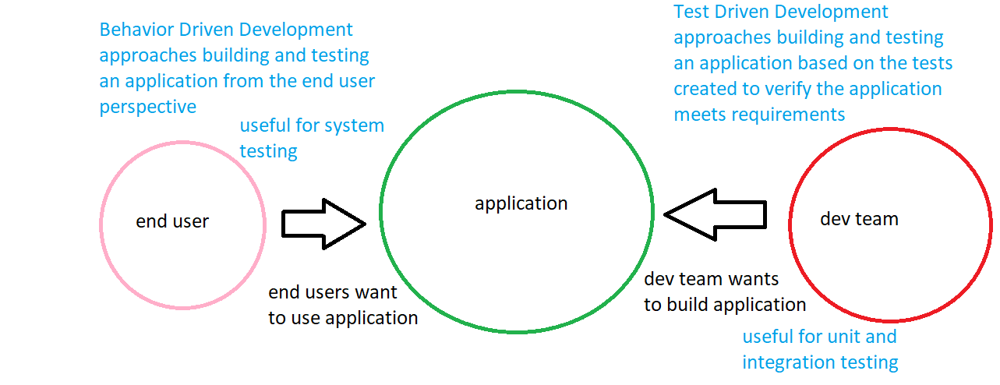

# BDD

## Acceptance Criteria
A common tool used in Behavior Driven Development is a Requirements Traceability Matrix: very similar to what testers might use, this document holds User Story information, development and/or testing assignments, and scenario information. In BDD, scenarios are typically designed around User Stories, which is not new, but the way the scenarios are crafted typically involves the use of "Acceptance Criteria". Acceptance Criteria used in Behavior Driven Development typically makes use of "Gherkin" syntax: this is a collection of key words that we can ultimately use to tie our Acceptance Criteria steps (think scenario steps) to blocks of code that can automate the process of executing those steps. This is because a very popular testing framework called "Cucumber" makes use of Gherkin syntax to connect test steps (your Acceptance Criteria) to executable code. This makes it very easy to craft individual code snippets to automate user actions, which makes it easy to create automated System tests.

## Gherkin Syntax
There are a few key words to be familiar with when writing Acceptance Criteria using Gherkin
- **Feature**: this is a high level description of one or more User Stories
    - **Scenario**: a narrow view or description of a User Story
    - **Scenario Outline**: parameterized view or description of a User Story
        - **Given**: this keyword is used to indicate a pre-condition that should be true for testing the User Story to begin
        - **When**: this keyword is used to indicate a step a user must take in order to complete the User Story
        - **Then**: this keyword is used to indicate the expected or intended result of the user completing the User Story
    - **Background**: this keyword can be used to set shared "Given" conditions between scenarios and scenario outlines
    - **Examples**: any data you want to inject into a Scenario Outline you put inside a table in your Examples section